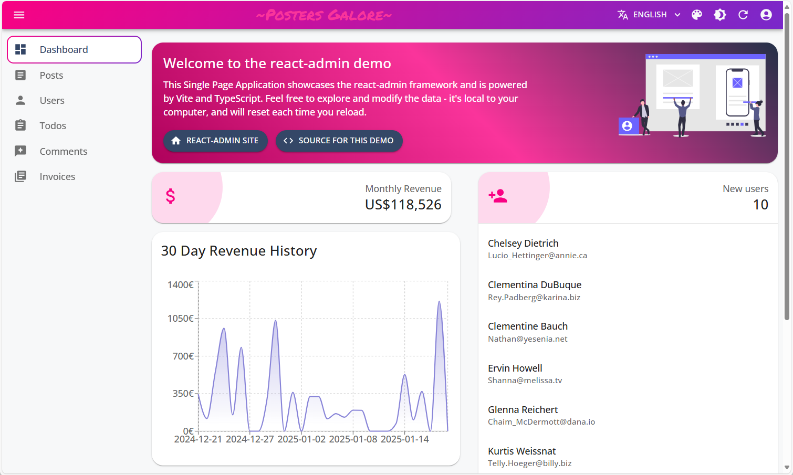
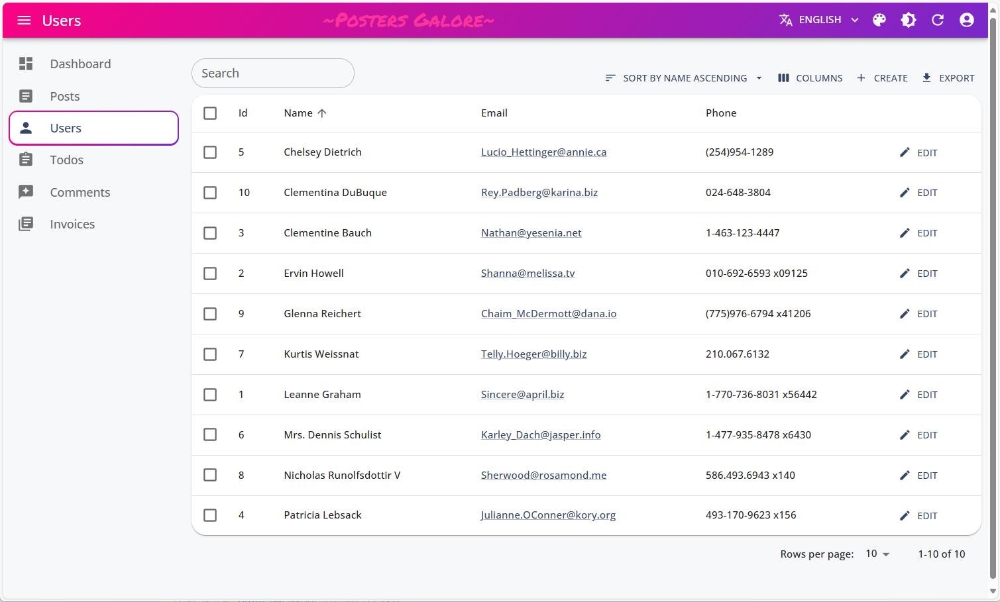
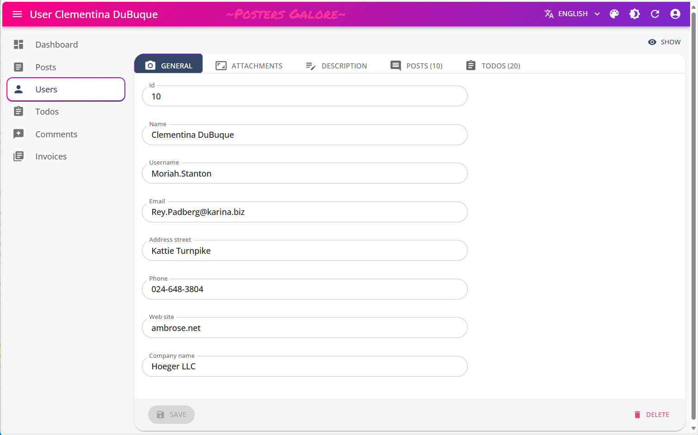
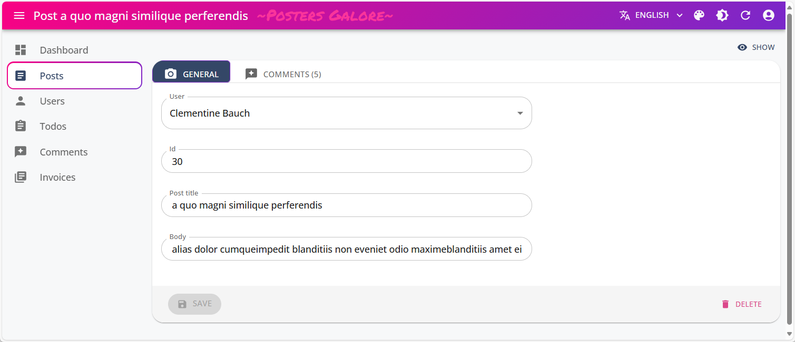

# ReactAdminShowcase

Single Page React Application (SPA) written in Typescript that uses the React-Admin framework (https://marmelab.com/react-admin/Tutorial.html).

A demo version of the application is available at https://juchertb.github.io/ReactAdminShowcase

**Logon with:** admin/password

## Single Page React Application

**Note:** The application requires Node.js to be installed.

After cloning the Github repository you need to run the following:

1. To install the npm modules referenced in package.json run: npm install
2. Starting the application in development mode: npm run dev

At this point the ReactAdminShowcase Single Page Application should load in the browser.

## DataProvider

The included data provider use [ra-data-json-server](https://github.com/marmelab/react-admin/tree/master/packages/ra-data-json-server). It fits REST APIs powered by [JSON Server](https://github.com/typicode/json-server), such as [JSONPlaceholder](https://jsonplaceholder.typicode.com/).

You'll find an `.env` file at the project root that includes a `VITE_JSON_SERVER_URL` variable. Set it to the URL of your backend. By default, we set it to targets [JSONPlaceholder](https://jsonplaceholder.typicode.com/).

The application also fetches the orders data from the "Fake Data Generator for retail" at https://www.npmjs.com/package/data-generator-retailorders to render the graph on the Dashboard.






## Installation

Install the application dependencies by running:

```sh
npm install
```

## Development

Start the application in development mode by running:

```sh
npm run dev
```

## Production

Build the application in production mode by running:

```sh
npm run build
```

## Deploying the application to GitHub pages

Refer to the "Deploying to GitHub Pages using gh-pages" documentation at https://dev.to/scc33/deploying-to-github-pages-using-gh-pages-2d95

Since we are using the Vite development framework, the deploy config setting should point to the dist folder ("deploy": "gh-pages -d dist").
